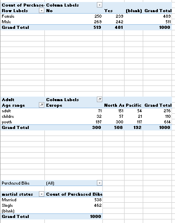

# Bike-purchase-Analysis

## Introduction/Overview
The "Analysis on Bike Purchase" project aims to explore and understand the various demographic and socioeconomic factors that influence individuals' decisions to purchase bikes. By analyzing a diverse set of attributes, including income, marital status, gender, education, occupation, home ownership, car ownership, commute distance, region, and age, we seek to uncover patterns and trends that differentiate bike buyers from non-buyers.
The insights gained from this analysis will be invaluable for businesses, marketers, and policymakers, enabling them to tailor their strategies to effectively target potential bike buyers. Additionally, this project will provide a comprehensive understanding of the key drivers behind bike purchases, facilitating more informed decision-making and strategy development in the bike retail industry.
# Data Source
The data used for the analysis of bike sales was collected through a survey using a google form, the survey gathered responses from diverse group of participate, providing detailed information of various demographic and socioeconomic factors.
# Tools:
By combining Excel for robust data cleaning and transformation with Power BI for sophisticated analysis and visualization, your project will benefit from a comprehensive approach to understanding bike purchase patterns. This workflow ensures that you can extract meaningful insights and communicate them clearly through engaging visualizations to stakeholders
1.	Excel for Data Cleaning and Transformation:
o	Data Cleaning: Excel will be used to clean the raw data by removing duplicates, correcting errors, and ensuring consistency across the dataset. Tools. like filters, sorting, and conditional formatting will aid in identifying and rectifying issues.
o	Data Transformation: Excel's capabilities, such as pivot tables, functions like IF statements, and data validation, will facilitate transforming the data into a structured format suitable for analysis. This step involves aggregating, summarizing, and organizing the data to prepare it for further analysis in Power BI.
2.	Power BI for Analysis and Visualization:
o	Data Analysis: Power BI will handle the deeper analysis tasks. This includes creating different data tables, performing calculations using DAX (Data Analysis Expressions), and deriving insightful metrics such as average purchase age, regional buying trends, and correlation between income and purchase likelihood.
o	Visualization: Power BI's strength lies in its ability to create interactive and visually compelling dashboards and reports. You'll use it to generate various charts (like bar charts, line graphs), maps, and slicers that allow stakeholders to explore the data dynamically. This facilitates presenting key findings and trends effectively.
# Data Cleaning and Transformation 
Steps Taken:
1.	Data Cleaning:
o	Marital Status and Gender: Standardized capitalization for consistency (e.g., changed "S" to "Single", ”M” to” Married”, “M” to “Male”, “F” to “Female”).
o	Age: Ensured all age values were correctly formatted and within reasonable ranges.
o	Checked for Errors and Duplicates: Identified and removed duplicate entries to maintain data integrity.
2.	Data Transformation:
o	Age Range Calculation: Calculated age ranges (“children” less that 31 yrs, "youth" for ages between 31-50, "adult" for ages 50 and above) to categorize individuals based on age demographics by using IF function as below =IF(L2>50,"adult",IF(L2>=31,"youth",IF(L2<31,"childre"))).
o	Derived Columns: Created new columns such as "age range" to facilitate easier analysis and categorization of age groups.
3.	Verification and Quality Check:
o	Validation: Ensured all transformations and calculations were accurately applied to the entire dataset.
o	Review: Cross-checked transformed data against original sources to validate accuracy and consistency.

## Data Description
The dataset contains information on individuals including demographic, socioeconomic, and behavioral attributes. The data include the following columns such as ID under ID we have description: Unique identifier for each individual. Then we have Marital Status which have marital status of the individual whether “married”, “single”. We have gender which descript as gender of the individual that is whether “male”, “Female”. Income is descripted as the annual income of the individual and the currency. Children is descripted as the number of children the individual has. Education has to do with the highest level of education attained by the individual whether “high school”, “partial college”, “bachelors”, “masters”, “PhD”. Occupation is the type of occupation the individual is engaged in whether “manual”, “clerical”, “skilled Manual”, “Professional”, “management”. Home Owner: Indicates whether the individual owns a home and we used “Yes”, “No” to indicate it. Cars: Number of cars owned by the individual. Commute Distance: Distance the individual commutes to work whether "0-1 Miles", "1-2 Miles", "2-5 Miles", "5-10 Miles", "10+ Miles". Region: Geographical region where the individual resides which are "Europe", "Pacific", "North America", "Asia", "Africa". Age: Age of the individual. Age Range: Categorization of age into ranges whether "Youth" (Below 40), "Adult" (40 and above). Purchased Bike: Indicates whether the individual has purchased a bike and we use "Yes", "No" to indicate it. This description provides an overview of the dataset's structure, types of data contained, and the possible values for categorical variables. It is useful for understanding the dataset and preparing for further analysis and visualization.
## Problem Statement
• Income and Bike Purchase Correlation: Investigate the correlation between income levels and the likelihood of bike purchases among different demographic groups.
• Age and Bike Purchase Trends: Analyze the impact of age on bike purchasing trends to determine if younger individuals are more inclined to buy bikes than older individuals.
• Marital Status and Bike Ownership: Examine the relationship between marital status and bike purchase behavior to understand if single or married individuals are more likely to buy bikes.
• Education Level and Bike Purchases: Assess the effect of education levels on bike purchasing decisions to identify if higher education correlates with increased bike purchases.
• Commute Distance and Bike Purchase: Explore the relationship between commute distance and the likelihood of bike purchases to see if individuals with shorter commutes are more inclined to buy bikes.
• Home Ownership and Bike Purchase: Analyze the impact of home ownership on bike purchasing behavior to determine if homeowners are more likely to purchase bikes than renters.
• Region and Bike Purchase Behavior: Investigate the influence of geographic region on bike purchase behavior to understand regional differences in bike buying trends.
• Occupation and Bike Purchase: Examine the effect of occupation types on bike purchasing decisions to identify which occupational groups are more likely to buy bikes.
• Number of Children and Bike Purchases: Evaluate the relationship between the number of children and bike purchasing behavior to determine if having more children influences bike purchase decisions.
• Gender Differences in Bike Purchase: Analyze gender differences in bike purchasing behavior to determine if there are significant disparities between male and female bike buyers.
## Analysis and summaries with pivot table
Analysis 1: Gender and Bike Purchase
•	Observation:
o	Females: 250 did not purchase, 233 purchased.
o	Males: 263 did not purchase, 242 purchased.
•	Summary: The distribution of bike purchases is relatively balanced between genders. However, slightly more females chose not to purchase a bike compared to males.
Analysis 2: Age Range and Region
•	Observation:
o	Adults:
	Europe: 71
	North America: 151
	Pacific: 54
o	Children:
	Europe: 32
	North America: 57
	Pacific: 21
o	Youth:
	Europe: 197
	North America: 300
	Pacific: 117
•	Summary:
o	Most of the bike purchases were made by youth, especially in North America and Europe.
o	The number of adult bike purchases is higher in North America than in Europe and the Pacific.
o	Children in North America and Europe also show a significant number of bike purchases compared to the Pacific region.
Analysis 3: Marital Status and Bike Purchase
•	Observation:
o	Married: 538
o	Single: 462
•	Summary:
o	There is a slightly higher number of bike purchases among married individuals compared to single individuals.
o	This may suggest that married individuals, possibly due to family needs or lifestyle choices, are slightly more inclined to purchase bikes than single individuals.
Marital Status and Bike Purchase
•	Observation:
o	Married: 538
o	Single: 462
•	Summary:
o	Insight: There are more bike purchases among married individuals (538) compared to single individuals (462). This could indicate that married people may be more likely to purchase bikes, possibly due to family needs or lifestyle choices.
2. Region and Bike Purchase
•	Observation:
o	Europe: 300
o	North America: 508
o	Pacific: 192
•	Summary:
o	Insight: North America leads in bike purchases with 508, followed by Europe with 300, and the Pacific region with 192. This suggests a higher interest or need for bikes in North America compared to the other regions. Cultural factors, infrastructure, and regional preferences might contribute to this trend.
3. Commute Distance and Bike Purchase
•	Observation:
o	0-1 Miles: 306
o	10+ Miles: 111
o	1-2 Miles: 183
o	2-5 Miles: 162
o	5-10 Miles: 138
•	Summary:
o	Insight: The highest number of bike purchases are among those with a commute distance of 0-1 miles (306), indicating that shorter commutes may encourage bike purchases. As the commute distance increases, the number of bike purchases decreases, suggesting that longer distances may discourage biking. This pattern highlights the importance of proximity in bike purchase decisions.

## Findings/Result
1.	Balanced Gender Appeal: Biking appeals equally to males and females, suggesting that marketing efforts can be gender-neutral.
2.	Marital Status Impact: Married individuals are a significant demographic for bike purchases, possibly due to family-oriented needs.
3.	Youth Preference: Younger individuals are more likely to purchase bikes, highlighting the importance of targeting this demographic with trendy and health-focused campaigns.
4.	Income Diversity: Biking appeals to a wide range of income levels, indicating its broad accessibility and appeal.
5.	Educational Outreach: Education does not heavily influence bike purchases, suggesting that awareness campaigns can be broadly targeted.
6.	Occupation Versatility: Biking suits various occupations, making it a versatile commuting and recreational option.
7.	Homeownership Advantage: Homeowners are more likely to purchase bikes, possibly due to easier storage solutions.
8.	Short Commute Preference: Bikes are favored for short commutes, emphasizing the need for promoting biking as a convenient short-distance travel option.
9.	Regional Focus: North America has the highest bike purchases, suggesting the potential for growth in other regions through targeted infrastructure and promotional efforts.
These findings provide a comprehensive understanding of the factors influencing bike purchases, offering valuable insights for developing targeted marketing strategies, improving infrastructure, and promoting biking as a healthy and sustainable mode of transportation
## Recommendations:
## 1.Target Younger Demographics
•	Recommendation: Develop marketing campaigns aimed at individuals below 50, highlighting the health benefits, convenience, and environmental impact of biking.
•	Action Steps: Use social media platforms, fitness apps, and collaborations with influencers to reach younger audiences. Organize community biking events and fitness challenges to engage this demographic. 
## 2. Focus on Married Individuals
•	Recommendation: Create family-oriented bike packages and promotions to appeal to married individuals.
•	Action Steps: Offer discounts on multiple bike purchases for families, create bundle deals that include bikes for adults and children, and promote family biking events.
## 3. Promote Biking for Short Commutes
•	Recommendation: Emphasize the benefits of biking for short commutes (0-1 miles) in urban areas.
•	Action Steps: Partner with local businesses to provide incentives for employees who bike to work. Promote the use of bikes for short errands and daily commutes through local advertisements and community programs.
## 4. Cater to Homeowners
•	Recommendation: Develop storage solutions and accessories specifically for homeowners to make bike storage more convenient.
•	Action Steps: Offer deals on bike racks, storage sheds, and security systems. Highlight the ease of storing and maintaining bikes at home in marketing materials.
## 5. Leverage Income Diversity
•	Recommendation: Offer a range of bike models at different price points to cater to various income levels.
•	Action Steps: Introduce entry-level bikes for budget-conscious customers and premium models for higher-income individuals. Provide flexible financing options and payment plans.
## 6. Regional Marketing Strategies
•	Recommendation: Tailor marketing efforts to the specific preferences and needs of different regions (Europe, North America, Pacific).
•	Action Steps: In regions with lower bike purchases, focus on raising awareness about the benefits of biking. Collaborate with local governments to improve biking infrastructure and safety. In high-purchase regions, introduce new models and accessories to keep the market engaged.
## 7. Education and Awareness Campaigns
•	Recommendation: Launch educational initiatives to promote the benefits of biking across different educational backgrounds.
•	Action Steps: Create informational content about biking's health, environmental, and economic benefits. Host workshops and webinars to educate potential customers on bike maintenance and safe riding practices.
## 8. Occupation-Specific Promotions
•	Recommendation: Develop promotional offers tailored to different occupational groups, highlighting how biking can fit into their lifestyles.
•	Action Steps: Offer discounts for employees in certain sectors, such as healthcare and education. Partner with companies to include bike purchase programs as part of employee benefits.
## 9. Expand Family-Friendly Options
•	Recommendation: Design and market bikes and accessories that cater to families with children.
•	Action Steps: Introduce child seats, trailers, and family biking gear. Promote family biking trips and safety gear to ensure a comfortable and secure riding experience for children.
## 10. Continuous Data Analysis and Feedback
•	Recommendation: Regularly analyze sales data and customer feedback to stay informed about changing preferences and trends.
•	Action Steps: Implement a system for collecting and analyzing customer feedback. Use this data to refine marketing strategies, product offerings, and customer service practices.

